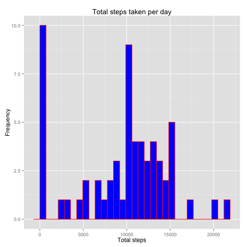
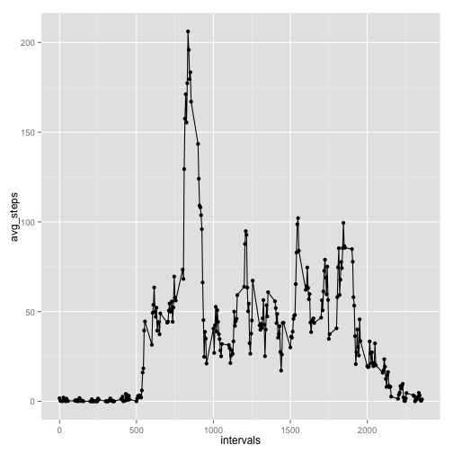
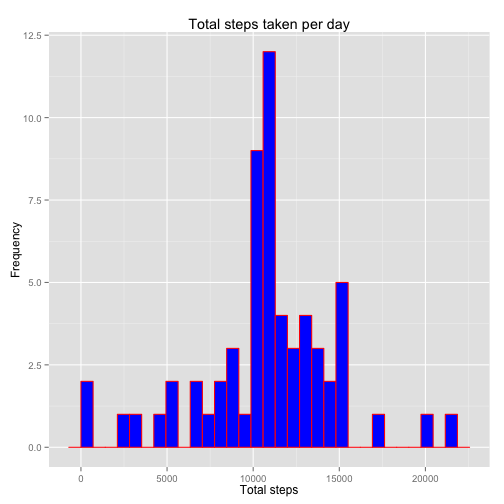
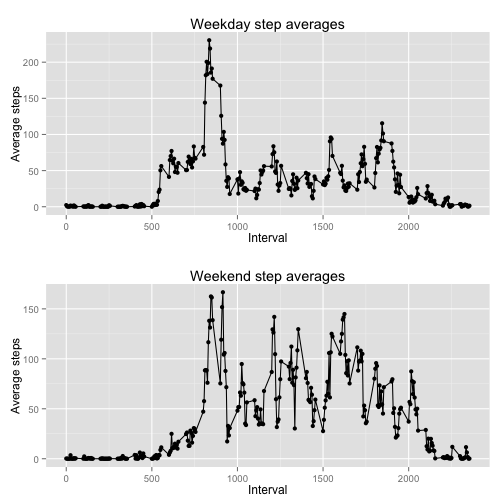

This document presents an analysis of the recorded number of steps by one individual 
over five minute time intervals everyday from October through November in 2012.

Load the appropriate libraries:


```r
library(knitr)
library(ggplot2)
library(dplyr)
library(gridExtra)
```

Head of the original imported dataset:


```r
  df = read.csv('activity.csv')
  print(head(df))
```

```
##   steps       date interval
## 1    NA 2012-10-01        0
## 2    NA 2012-10-01        5
## 3    NA 2012-10-01       10
## 4    NA 2012-10-01       15
## 5    NA 2012-10-01       20
## 6    NA 2012-10-01       25
```

Histogram of the total number of steps taken per day:


```r
total_steps = integer(0)
week = as.character(df$date)
week = unique(week)
for(i in 1:length(week)) {
  sbst = subset(df, df$date == week[i])
  total_steps = c(total_steps, sum(sbst$steps, na.rm = TRUE))
}
histogram = qplot(total_steps, geom = 'histogram', main = 'Total steps taken per day', 
                  xlab = 'Total steps', ylab = 'Frequency', col = I('red'), 
                  fill = I('blue'))
print(histogram)
```

 

Mean and median of the total number of steps taken per day:


```r
print(mean(total_steps, na.rm = TRUE))
```

```
## [1] 9354.23
```

```r
print(median(total_steps, na.rm  = TRUE))
```

```
## [1] 10395
```

Time series plot of the number of steps taken per time interval averaged across all days:

```r
avg_steps = numeric(0)
filtered = filter(df, steps >= 0)
intervals = unique(filtered$interval)
for(i in 1:length(intervals)){
  sbst = subset(filtered, filtered$interval == intervals[i])
  avg_steps = c(avg_steps, mean(sbst$steps))
}
steps_by_interval = as.data.frame(cbind(intervals, avg_steps))
ggplot(steps_by_interval, aes(x = intervals, y = avg_steps)) + geom_line() + geom_point()
```

 

Time interval containing the maximum number of steps:

```r
print(intervals[which(avg_steps == max(avg_steps))])
```

```
## [1] 835
```

Number of missing values:


```r
steps = df$steps
print(length(steps[which(is.na(steps) == TRUE)]))
```

```
## [1] 2304
```

New histogram of total number of steps taken per day with missing values filled in.
Missing values (NA) were replaced with the average for that 5 minute interval.


```r
#Fill in missing values w/ average # of steps for that time interval
full_intervals = df$interval
for(i in 1:length(steps)) {
  if(is.na(steps[i])) {
    extract_steps = filter(steps_by_interval, intervals == full_intervals[i])
    steps[i] = extract_steps[,2]
  }
}
df$steps = steps
#recreate the histogram of the total number of steps taken per day
total_steps = integer(0)
week = as.character(df$date)
week = unique(week)
for(i in 1:length(week)) {
  sbst = subset(df, df$date == week[i])
  total_steps = c(total_steps, sum(sbst$steps, na.rm = TRUE))
}
histogram = qplot(total_steps, geom = 'histogram', main = 'Total steps taken per day', 
                  xlab = 'Total steps', ylab = 'Frequency', col = I('red'), 
                  fill = I('blue'))
print(histogram)
```

 

Mean and median of the total number of steps taken per day with NA values replaced:


```r
print(mean(total_steps))
```

```
## [1] 10766.19
```

```r
print(median(total_steps))
```

```
## [1] 10766.19
```

Replacing NA values appears to normalize the data, as evidenced by the equivalent mean
and median step values.

Time series of average step number averaged across all days on either weekends or
weekdays:


```r
#Create a second time-series plot of intervals vs. steps averaged over weekends or weekdays
#Determine if each date is a weekend or weekday
df$date = as.Date(as.character(df$date))
dates = df$date
weekdays1 = c('Monday', 'Tuesday', 'Wednesday', 'Thursday', 'Friday')
day_type = character(0)
for(i in 1:length(dates)) {
  if(weekdays(dates[i]) %in% weekdays1) {
    day_type = c(day_type, 'weekday')
  }
  else {
    day_type = c(day_type, 'weekend')
  }
}
df = cbind(df, day_type) #add new identifer column to original dataframe
#filter dataframe by weekend/weekday and collect step averages for each interval
filtered_weekday = filter(df, day_type == 'weekday')
filtered_weekend = filter(df, day_type == 'weekend')
weekday_avgs = numeric(0)
weekend_avgs = numeric(0)
for(i in 1:length(intervals)) {
  sbst = subset(filtered_weekday, filtered_weekday$interval == intervals[i])
  weekday_avgs = c(weekday_avgs, mean(sbst$steps))
}
for(i in 1:length(intervals)) {
  sbst = subset(filtered_weekend, filtered_weekend$interval == intervals[i])
  weekend_avgs = c(weekend_avgs, mean(sbst$steps))
}
#Combine weekend/weekday averages into a new data frame and plot
steps_by_day = as.data.frame(cbind(intervals, weekday_avgs, weekend_avgs))
plot1 = ggplot(steps_by_day, aes(x = intervals, y = weekday_avgs)) + geom_line() + 
  geom_point() + ggtitle('Weekday step averages') + xlab('Interval') + ylab('Average steps')
plot2 = ggplot(steps_by_day, aes(x = intervals, y = weekend_avgs)) + geom_line() + 
  geom_point() + ggtitle('Weekend step averages') + xlab('Interval') + ylab('Average steps')
grid.arrange(plot1, plot2) #prints multiple plots to one screen
```

 
